# Loop Semantics in Copper Simulation

A focused reference on what `loop` means inside a Copper module, how single-module and multi-module infinite loops differ, the distinction between combinational and sequential modules, and how all of these map to real hardware concepts.

For the full execution model (executor internals, signal registry, VCD export, etc.) see [EXECUTION_MODEL.md](EXECUTION_MODEL.md).

---

## Combinational vs sequential modules

The fundamental distinction in synchronous digital design is whether a piece of logic has memory. Combinational logic is stateless — its output is a pure function of its current inputs, with no dependence on history. Sequential logic has registers — state that persists across clock edges.

Copper encodes this distinction in the suspension primitive a module uses.

### Sequential: `clk.tick().await`

A sequential module suspends on a clock edge. Its local variables persist across the suspension — they become registers in the generated hardware (or fields in the Rust `Future` struct in simulation).

```rust
async fn counter(clk: Clock<MainClk>, out: Out<Bits<8>>) {
    let mut count = Bits::<8>::from_u128(0);   // register: persists across .await
    loop {
        out.write(count);
        clk.tick().await;                       // suspend until next rising edge
        count = count + Bits::from_u128(1);     // update register after edge
    }
}
```

**Hardware analog — D flip-flop / registered logic:**

```verilog
always @(posedge clk)
    count <= count + 1;
```

The `clk.tick().await` is the rising edge. Everything before it in the loop body is sampled; everything after it is the next-state computation. Variables live across the `.await` are registers.

**Simulation behavior:** During `tick_clock`, sequential modules are suspended (returning `Poll::Pending`) in the pre-edge settle phase. After `clk.advance()`, they wake, run their loop body once, write their output, and suspend again at the next `clk.tick().await`. They contribute exactly one delta cycle of activity per clock edge.

---

### Combinational (intra-module): plain Rust function

The simplest and preferred form. Combinational logic inside a module is a plain synchronous function called within the sequential loop body. No `async`, no `.await`, no delta cycles.

```rust
fn add(a: u8, b: u8) -> u8 { a.wrapping_add(b) }

async fn adder_reg(clk: Clock<MainClk>, a: In<u8>, b: In<u8>, out: Out<u8>) {
    loop {
        out.write(add(a.read(), b.read()));   // combinational, inline
        clk.tick().await;
    }
}
```

**Hardware analog — `assign` wire / combinational `always` block:**

```verilog
assign result_wire = a + b;           // continuous assignment
// or equivalently:
always @(*) result_wire = a + b;      // combinational always block
```

The function re-evaluates every time the loop body runs. There is no separate task in the executor, no delta-cycle overhead. This is the right choice for any combinational logic internal to a module.

---

### Combinational (inter-module): `delta_yield().await`

When combinational logic must be a **separate named module** — connecting two signals, visible in waveforms, or reused across designs — it is written as an async task that re-evaluates every delta cycle using `delta_yield().await` instead of `clk.tick().await`.

```rust
async fn doubler(input: In<u8>, out: Out<u8>) {
    loop {
        out.write(input.read().wrapping_mul(2));
        delta_yield().await;    // yield for one delta cycle, then re-evaluate
    }
}
```

`delta_yield()` returns `Poll::Pending` on the first poll and `Poll::Ready` on the second. This gives the executor exactly one delta cycle of separation between re-evaluations — the module suspends, lets other tasks run, then immediately re-runs when polled again.

Wiring it between two sequential modules:

```rust
let wire_in  = exec.register_signal("wire_in",  0u8);
let wire_mid = exec.register_signal("wire_mid", 0u8);
let wire_out = exec.register_signal("wire_out", 0u8);

exec.spawn(stage1(clk.clone(), In::new(wire_in),  Out::new(wire_mid)));
exec.spawn(doubler(            In::new(wire_mid), Out::new(wire_out)));
exec.spawn(stage2(clk.clone(), In::new(wire_out), ...));
```

**Hardware analog — continuous `assign` wire at module boundary:**

```verilog
assign wire_mid = wire_in * 2;
```

**Simulation behavior:** Combinational tasks are active in *both* the pre-edge and post-edge settle phases — they run every time `poll_tasks` is called, not just after a clock edge. This is correct: a wire in hardware responds to input changes regardless of where in the clock cycle they occur.

---

### `delta_yield` vs `clk.tick`: what the executor sees

| | Sequential (`clk.tick().await`) | Combinational (`delta_yield().await`) |
|---|---|---|
| Suspension condition | Waits for `clk.cycle >= target` | Always ready on the second poll |
| Active in pre-edge settle | No — returns `Pending` | Yes — re-evaluates every delta pass |
| Active in post-edge settle | Yes — once per edge | Yes — re-evaluates every delta pass |
| Carries state across suspension | Yes — local `mut` vars = registers | No — should be stateless |
| Output written via | `Out<T>.write()` | `Out<T>.write()` |
| Hardware analog | Flip-flop / register | Wire / `assign` / combinational `always` |

---

### Combinational loops resolve to X

If a combinational module's output feeds back to its own input — directly or through a chain — it oscillates. The output flips every delta cycle with no fixed point. The executor detects this via `consecutive_dirty` and injects `X` (unknown) when the threshold is reached:

```rust
// self-inverter: Out<Logic> feeds back as In<Logic>
async fn self_inverter(input: In<Logic>, out: Out<Logic>) {
    loop {
        out.write(match input.read() {
            Logic::Zero => Logic::One,
            Logic::One  => Logic::Zero,
            Logic::X    => Logic::X,
        });
        delta_yield().await;
    }
}
// Result after poll_tasks(): Logic::X
```

**Hardware analog:** A combinational feedback loop with no register in the path is a glitch in real hardware — the gate output races against its own input and the voltage oscillates at some indeterminate frequency. Verilog simulators resolve this the same way: the signal is driven to `X` (unknown) because no stable value satisfies the logic equation.

```verilog
assign q = ~q;   // q oscillates → Verilog sim drives q to X
```

Sequential feedback (a register in the loop) is fine and common — it is just a state machine. The register breaks the combinational path and provides a stable value for one clock cycle.

---

### When a combinational module needs an infinite loop vs when it doesn't

The deciding question is: **does the combinational logic have a parent that will call it?**

#### No loop needed — inline as a plain function

If the combinational logic belongs entirely to one sequential parent, call it as a plain Rust function inside that parent's loop body. The parent's `loop` drives re-evaluation; no separate task or `loop` + `delta_yield` is needed.

```
sequential ──[calls]──> fn combinational_logic(...)
```

```rust
fn decode(instruction: u32) -> Op { ... }   // pure combinational

async fn cpu(clk: Clock<MainClk>, ir_in: In<u32>, out: Out<Op>) {
    loop {
        out.write(decode(ir_in.read()));   // re-evaluated every cycle
        clk.tick().await;
    }
}
```

The function runs once per clock cycle as part of the parent's single poll. No executor task, no delta-cycle overhead, no `loop` of its own.

#### Loop required — standalone async task

A combinational module needs its own `loop { ... delta_yield().await; }` whenever it cannot be inlined into a single parent. The three cases:

**1. Sits between two sequential modules**

The logic has no single parent to call it — it must be its own executor task to stay alive and re-evaluate between clock edges.

```
sequential ──[wire]──> combinational ──[wire]──> sequential
```

```rust
async fn middle(input: In<u8>, out: Out<u8>) {
    loop {
        out.write(input.read().wrapping_mul(2));
        delta_yield().await;
    }
}
```

The second sequential module samples the combinational output during the pre-edge settle phase. Without the `loop`, the combinational task completes after one evaluation and goes dead — the signal it drives is never updated again.

The alternative is to absorb the logic into one of the two sequential modules (either at the end of the upstream's loop body or at the start of the downstream's), eliminating the separate task entirely.

**2. Shared between multiple parents**

If more than one module reads from the combinational output, it must be its own task. Inlining would mean duplicating the logic — and worse, two copies could produce different values in the same delta cycle if their parent loops are at different poll points.

```
           ┌──[wire]──> sequential A
combinational
           └──[wire]──> sequential B
```

**3. Needs to appear in the module hierarchy or waveforms**

Even if it has one parent, making it a named standalone task gives it an entry in the executor's module map and makes its output signal traceable in VCD output. This is a tooling concern, not a correctness concern.

#### Decision rule

```
Does the logic have exactly one parent that drives it?
│
├─ Yes → inline as a plain function inside the parent's loop
│         (simplest, zero overhead)
│
└─ No  → standalone async task with loop { ... delta_yield().await; }
          (sits between two modules, shared by multiple parents,
           or needs its own identity in the hierarchy)
```

---

## The one rule

Every sequential Copper module must have exactly one top-level `loop { ... clk.tick().await; ... }`. Everything inside that loop runs once per clock cycle. Everything outside of it (before the loop starts) runs once at initialization.

---

## Single module, one infinite loop

```rust
async fn counter(clk: Clock<MainClk>, out: Out<u8>) {
    let mut value = 0u8;
    loop {
        out.write(value);       // 1. drive output
        clk.tick().await;       // 2. suspend until next edge
        value += 1;             // 3. update state
    }
}
```

The entire loop body is one continuous Rust coroutine execution. Steps 1–3 happen atomically within a single poll — the executor never interrupts between them. There are no races, no delta-cycle passes needed, and no external coordination.

**Hardware analog — a single always block / process:**

```verilog
always @(posedge clk) begin
    out   <= value;
    value <= value + 1;
end
```

Both model the same thing: one piece of logic that reads its state, computes the next output, and registers the update on the clock edge. All causality is local to that block.

### Multiple `clk.tick().await` in one loop = multi-cycle behavior

```rust
loop {
    let a = stage_in.read();
    clk.tick().await;               // pipeline stage boundary
    let b = expensive(a);           // `a` is a pipeline register here
    out.write(b);
    clk.tick().await;
}
```

Variables that are live across a `.await` point are stored in the generated `Future` struct — they are pipeline registers. This is how Copper encodes a 2-stage pipeline: straight-line code, no state enum, no explicit register declarations.

**Hardware analog:**

```verilog
always @(posedge clk) begin
    stage1_reg <= stage_in;
    out        <= expensive(stage1_reg);
end
```

---

## Multiple modules, each with an infinite loop

Each module is an independent Rust future. The executor holds them all in a `Vec<TaskEntry>` and polls them one after another within each delta-cycle pass. Modules communicate through named signals in the signal registry, connected via `In<T>` and `Out<T>`.

### Independent modules (no shared signals)

```rust
let out_a = exec.register_signal("counter_a", 0u8);
let out_b = exec.register_signal("counter_b", 0u8);

exec.spawn(counter(clk.clone(), Out::new(out_a)));
exec.spawn(counter(clk.clone(), Out::new(out_b)));
```

The two futures never interact. The executor polls each in sequence, but their state never intersects — they just share a clock.

**Hardware analog — two unrelated always blocks:**

```verilog
always @(posedge clk) counter_a <= counter_a + 1;
always @(posedge clk) counter_b <= counter_b + 1;
```

### Connected modules (output of one feeds input of another)

```rust
let stage1_out = exec.register_signal("stage1_out", 0u8);
let stage2_out = exec.register_signal("stage2_out", 0u8);

exec.spawn(stage1(clk.clone(), In::new(raw_input), Out::new(stage1_out)));
exec.spawn(stage2(clk.clone(), In::new(stage1_out), Out::new(stage2_out)));
```

The same `SignalHandle` (`stage1_out`) is passed as `Out<T>` to the writer and `In<T>` to the reader. After the clock edge, the executor polls both tasks in spawn order. Because `stage1` was spawned first, it runs first, writes its new value to the signal slot, and marks the slot dirty. `stage2` then runs in the same delta-cycle pass and reads the already-updated value via `In<T>.read()`.

**This means stage2 sees stage1's new value in the same clock cycle** — the pipeline has no register between stages from the simulation's perspective. If a one-cycle delay between stages is needed, it must be encoded explicitly with a register module in between or a second `clk.tick().await` in the loop.

**Hardware analog — chained always blocks with blocking assignments:**

```verilog
always @(posedge clk) stage1 = in + 1;      // blocking
always @(posedge clk) stage2 = stage1 * 2;  // reads stage1 immediately
```

Using non-blocking assignments (`<=`) gives one-cycle latency instead — each stage samples the previous cycle's value.

---

## Delta cycles

A delta cycle is a zero-time simulation step. It does not advance the clock — it is one full pass over all tasks, checking whether any signal value changed.

After the clock edge fires, all sequential modules wake up and write new values to their output signals. But in a multi-module design, downstream modules might have already run in the same pass before upstream wrote. The executor handles this by running passes in a loop until no signal changes:

```
Clock edge fires
│
├─ Delta 0: stage1 writes 5 to its signal slot (changed → dirty)
│           stage2 reads stale value 4, writes 8 (changed → dirty)
│
├─ Delta 1: stage1 at next tick → Pending, no change
│           stage2 reads new value 5, writes 10 (changed → dirty)
│
└─ Delta 2: both at next tick → Pending, no change
            any_dirty = false → fixed point ✓
```

The number of delta cycles needed equals the depth of the combinational or sequential fan-out chain. Each module adds at most one delta cycle per level.

**Hardware analog — event-driven simulation in Verilog:**

Verilog simulators use the same mechanism. Simulation time has two dimensions: real time and a delta count. Events scheduled at time T+1Δ happen before T+2Δ, but both are "at time T." A wire assignment that triggers another assignment at the same time fires in the next delta. The simulator keeps re-evaluating until no more events remain in the current time step.

```
T=10ns, Δ0: A changes → schedules B update
T=10ns, Δ1: B changes → schedules C update
T=10ns, Δ2: C changes, nothing new → settled
T=10ns is done, advance to T=20ns
```

---

## Two-phase modules: init then steady-state

An init phase before the main loop is valid and works naturally in simulation:

```rust
async fn module(clk: Clock<MainClk>, out: Out<u8>) {
    let mut value = 0u8;

    // Init phase — runs until condition, no output written
    loop {
        clk.tick().await;
        value += 1;
        if value >= 3 { break; }
    }

    // Steady-state phase — runs forever
    loop {
        out.write(value);
        clk.tick().await;
        value += 1;
    }
}
```

When the init loop breaks, the future falls immediately into the steady-state loop within the same poll — no extra clock cycle is consumed for the transition. The first `out.write()` fires in the same post-edge settle as the `break`.

**Hardware analog — an FSM with a reset/init state:**

```verilog
typedef enum { INIT, RUNNING } state_t;
state_t state;
integer count;

always @(posedge clk) begin
    case (state)
        INIT: begin
            count <= count + 1;
            if (count >= 2) state <= RUNNING;
        end
        RUNNING: begin
            out   <= count;
            count <= count + 1;
        end
    endcase
end
```

In Copper the state machine is implicit: Rust control flow (the `break`) replaces the explicit `state` register and `case` statement.

---

## The second loop after an infinite loop is dead code

```rust
loop {
    out.write(value);
    clk.tick().await;   // never breaks → future suspended here forever
}
// unreachable: Rust warns, second loop never executes
loop {
    out.write(255);     // this never fires
    clk.tick().await;
}
```

Rust will warn (`unreachable_code`) and the future is permanently suspended in the first loop. In simulation, the executor simply never polls past the first `clk.tick().await` that stays Pending.

---

## Connection topology diagrams

### Single sequential module

Structure — one task, one signal:

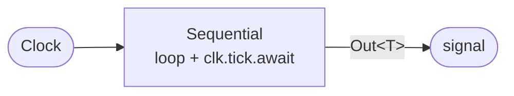

Execution within one `tick_clock`:

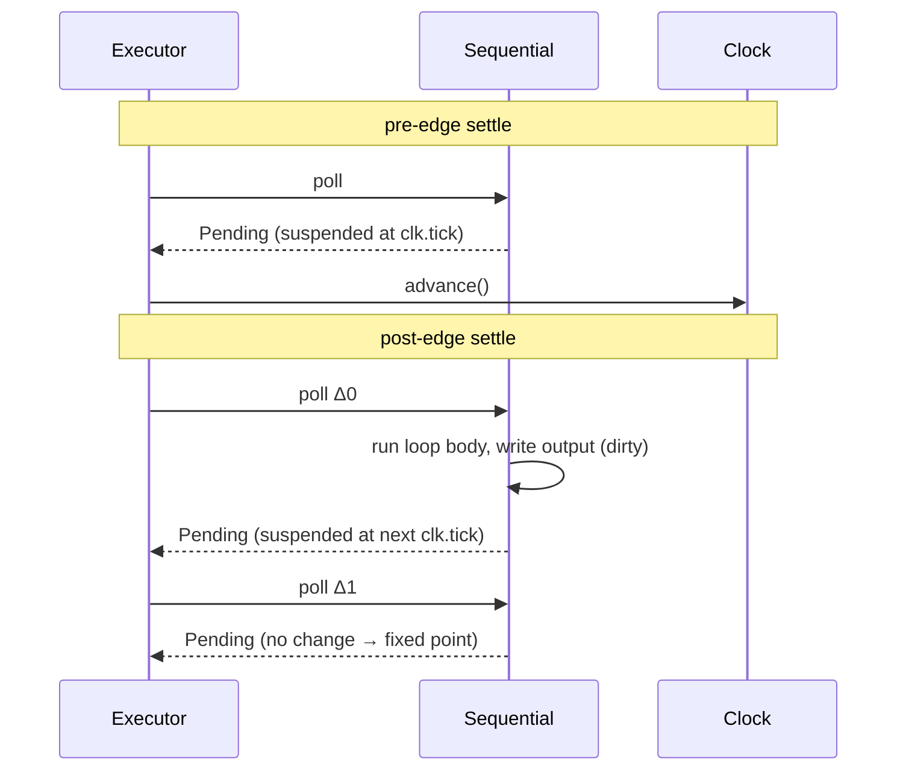

---

### Two independent sequential modules

Structure — two tasks, no shared signals:

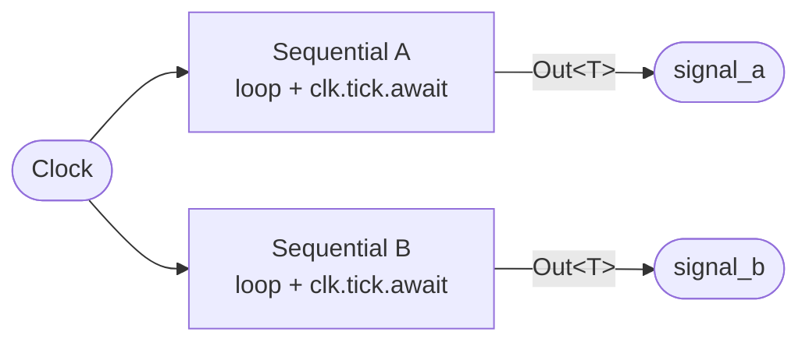

Execution — both wake on the same edge, neither affects the other:

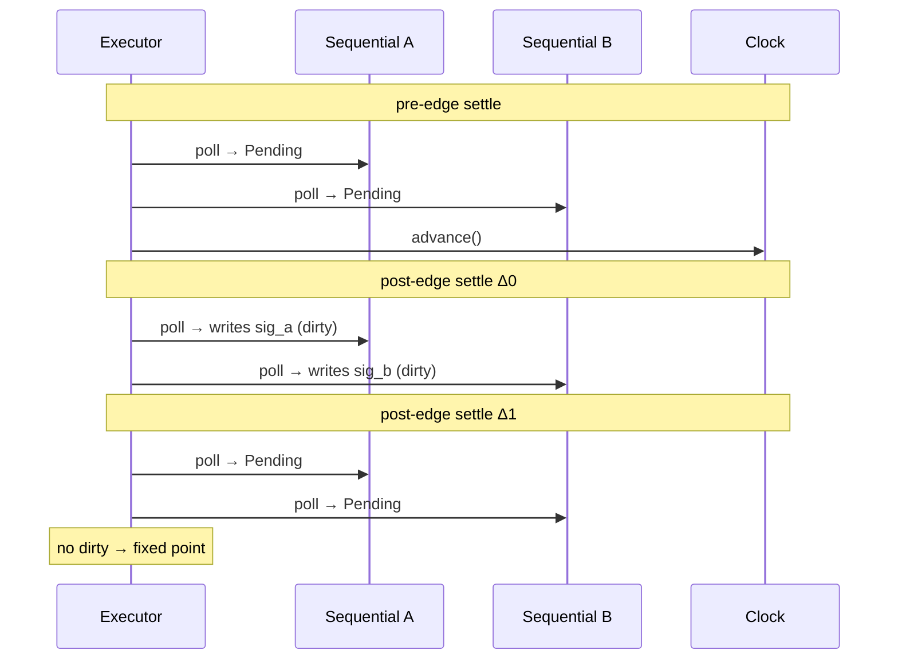

---

### Two connected sequential modules

Structure — upstream output is downstream input:

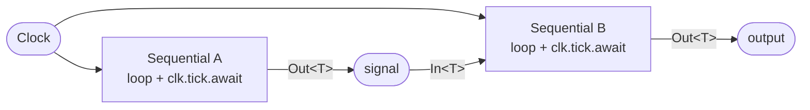

Execution — A spawned before B, so A runs first in every delta pass. B reads A's new value in the same delta cycle it was written:

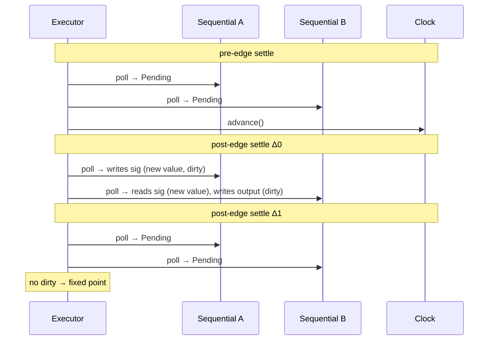

If B were spawned before A, B would read the stale value in Δ0 and need an extra delta cycle to correct — settling in Δ2 instead of Δ1.

---

### Sequential → combinational (intra-module) → output

Structure — combinational logic is a plain function call inside the sequential loop, no separate task:

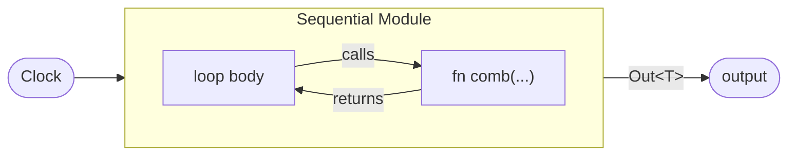

Execution — the function call is invisible to the executor, everything happens within a single poll:

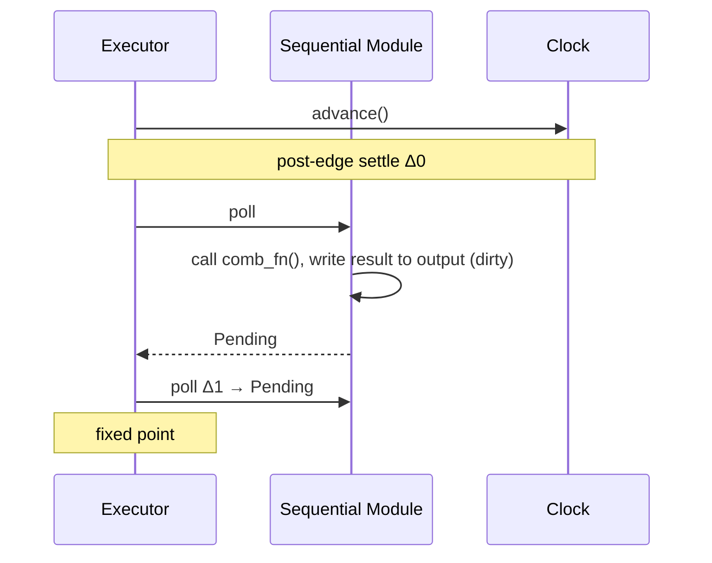

---

### Sequential → combinational (inter-module) → sequential

Structure — combinational is a standalone task between two sequentials:

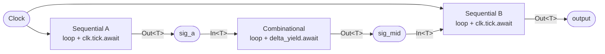

Execution — spawned in order A, C, B. The combinational module re-evaluates in the same delta pass as A, so B sees the fully propagated value in Δ0:

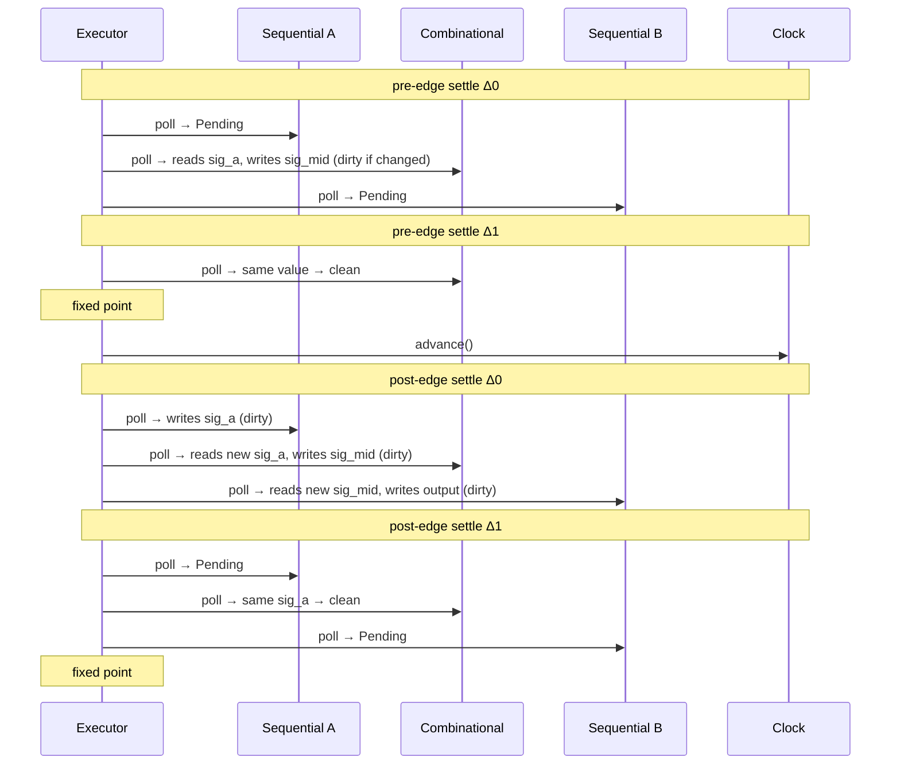

---

### Parent-child (sequential instantiating sequential)

Structure — inner module is a separate spawned task, connected via signals, nested in the hierarchy:

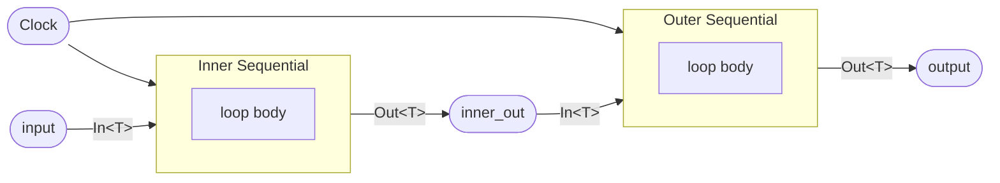

Execution — identical to two connected sequential modules. The parent-child label is bookkeeping only; the executor treats both as independent tasks:

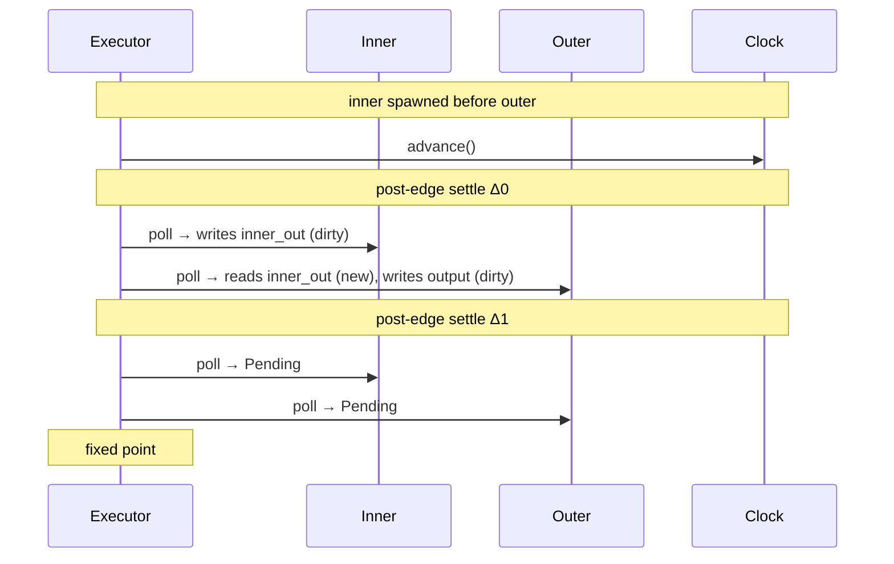

---

## Summary table

| Scenario | Rust model | Hardware analog |
|---|---|---|
| Single infinite loop | One coroutine, one `Future` | One `always @(posedge clk)` block |
| Multiple `clk.tick().await` in one loop | Variables live across `.await` = registers | Multi-stage pipeline in one `always` block |
| Two independent modules | Two futures, no shared signals | Two unrelated `always` blocks |
| Two connected modules | Two futures, shared `SignalHandle<T>` via `In<T>` / `Out<T>` | Two `always` blocks with a wire between them |
| Delta cycle | One pass over all tasks in zero sim-time | Verilog delta cycle / event propagation |
| Init then steady-state | Two `loop` blocks, first has `break` | FSM with INIT and RUNNING states |
| Second loop after infinite first | Unreachable dead code | Logic after an unconditional `always` loop — impossible in HDL |
| Combinational intra-module | Plain Rust function called inside parent's loop | `assign` / combinational logic inside an `always` block |
| Combinational inter-module | Standalone task with `loop` + `delta_yield().await` | Named `assign` wire or combinational module at boundary |
