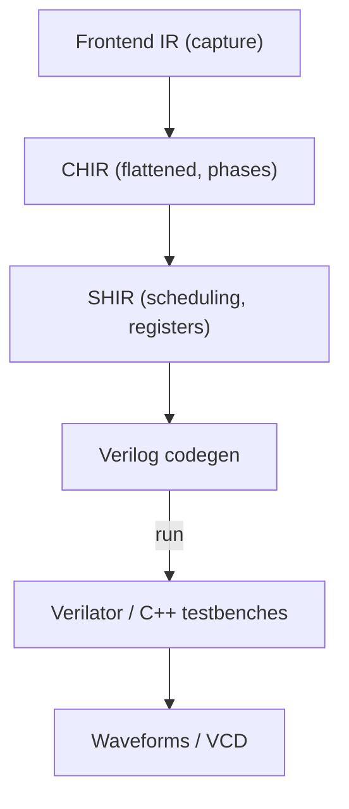

# Transpilation pipeline (Frontend → CHIR → SHIR → Verilog)

```mermaid
flowchart TD
  FrontendIR["Frontend IR (capture)"] --> CHIR["CHIR (flattened, phases)"]
  CHIR --> SHIR["SHIR (scheduling, registers)"]
  SHIR --> Verilog["Verilog codegen"]
  Verilog -->|run| Verilator["Verilator / C++ testbenches"]
  Verilator --> Waveforms["Waveforms / VCD"]
```
