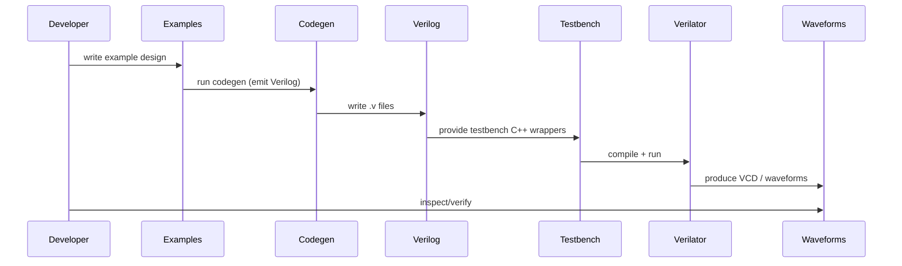

# Verification / test flow

```mermaid
sequenceDiagram
  participant Dev as Developer
  participant Examples as Examples
  participant Codegen as Codegen
  participant Verilog as Verilog
  participant TB as Testbench
  participant Verilator as Verilator
  participant Wave as Waveforms

  Dev->>Examples: write example design
  Examples->>Codegen: run codegen (emit Verilog)
  Codegen->>Verilog: write .v files
  Verilog->>TB: provide testbench C++ wrappers
  TB->>Verilator: compile + run
  Verilator->>Wave: produce VCD / waveforms
  Dev->>Wave: inspect/verify
```
