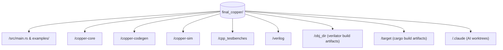

# Workspace layout

```mermaid
graph TB
  Root[(final_copper/)]
  Root --> src["/src/main.rs & examples/"]
  Root --> copper-core["/copper-core"]
  Root --> copper-codegen["/copper-codegen"]
  Root --> copper-sim["/copper-sim"]
  Root --> cpp_testbenches["/cpp_testbenches"]
  Root --> verilog["/verilog"]
  Root --> obj_dir["/obj_dir (verilator build artifacts)"]
  Root --> target["/target (cargo build artifacts)"]
  Root --> .claude["/.claude (AI worktrees)"]
```
