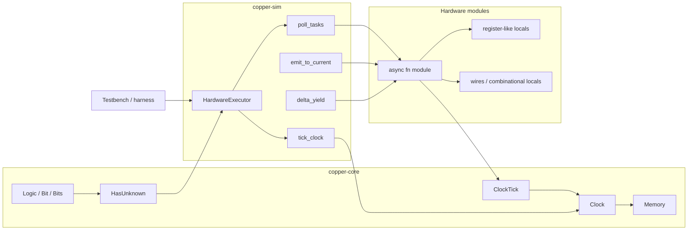

# Simulation component diagram

```mermaid
graph LR
  subgraph Sim[copper-sim]
    Exec[HardwareExecutor]
    Poll[poll_tasks]
    Tick[tick_clock]
    Emit[emit_to_current]
    Delta[delta_yield]
  end

  subgraph Core[copper-core]
    Clock[Clock]
    TickFuture[ClockTick]
    Mem[Memory]
    Logic[Logic / Bit / Bits]
    Unknown[HasUnknown]
  end

  subgraph Module[Hardware modules]
    Async[async fn module]
    State[register-like locals]
    Comb[wires / combinational locals]
  end

  Test[Testbench / harness]

  Test --> Exec
  Exec --> Poll
  Exec --> Tick
  Poll --> Async
  Async --> TickFuture
  TickFuture --> Clock
  Tick --> Clock
  Clock --> Mem
  Emit --> Async
  Delta --> Async
  Async --> State
  Async --> Comb
  Logic --> Unknown
  Unknown --> Exec
```
